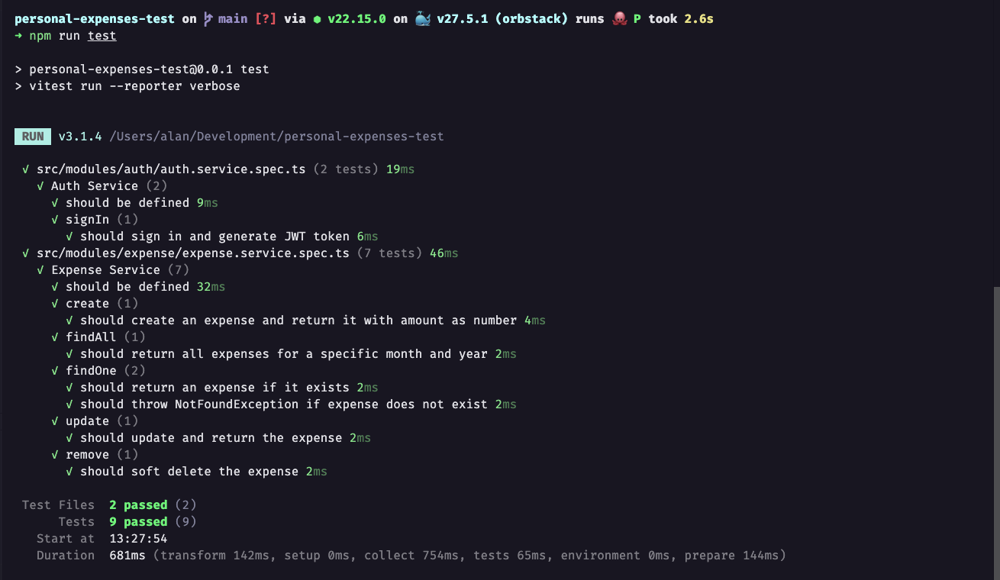

<p align="center">
  <a href="https://github.com/alanhrc/personal-expenses-test" target="_blank"></a>
</p>

---

## 📦 Tech Stack

- [NestJS](https://nestjs.com/)
- [PostgreSQL](https://www.postgresql.org/)
- [Prisma](https://www.prisma.io/)
- [Docker](https://www.docker.com/)
- [Vitest](https://vitest.dev/) for testing

---

## 🚀 Getting Started

### Clone the repository

```bash
## Clone repo
git clone git@github.com:alanhrc/personal-expenses-test.git your-repo-name

## Open repo
cd your-repo-name

## Project setup
$ npm install
```

### 🐳 Setup environments and docker

```bash
## Clone .env
cp .env.test .env

## Run docker compose
docker compose up -d
```

### 🛠️ Setup the Database

```bash
## Run migrations
npx prisma migrate dev

## Prisma generate
npx prisma generate
```

### ▶️ Compile and run the project

```bash
# development
$ npm run start

# watch mode
$ npm run start:dev

# production mode
$ npm run start:prod
```

### ✅ Running Tests

```bash
# unit tests
$ npm run test

# e2e tests
$ npm run test:e2e

# test coverage
$ npm run test:cov
```

<p align="center">
  
</p>

<p align="center">
  
</p>

### 📚 Documentation

```bash
# Docs url
http://localhost:3333/api
```
<p align="center">
  
  
</p>